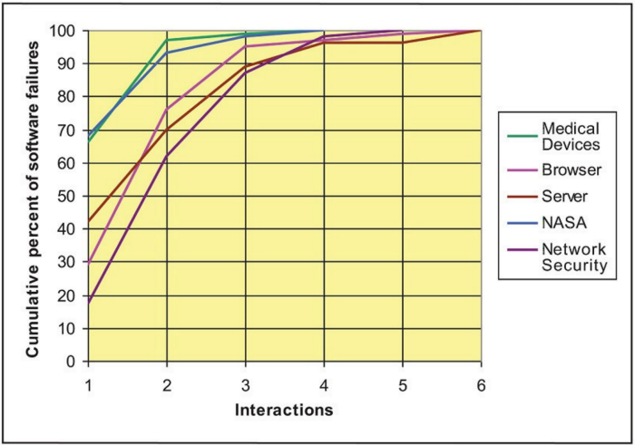

Combinatorial Testing
=====================

Nowadays, software systems are complex and can have multiple possible configurations, for example, an application can have multiple target operating systems, execute in various types of hardware, and in multiple resolutions. But also those applications can have multiple states which they are in.
Those multiple parameters for a system cause different behaviors alone and when combined, so multiple combinations of a system’s parameters must be tested to achieve optimal test coverage, and catch errors that wouldn't be detected executing simple tests. But as the number of parameters and its possible values raise, the number of possible combinations rises exponentially, making it impossible to exhaustively test the software, given the time and budget constraints often existent on software projects.

A way to overcome those limitations is by using Combinatorial Testing, a method for software testing that for some input parameters, tests possible discrete combinations of those parameters, generating those combinations by systematically covering t-way interactions between parameters, the "t" being called the degree of interaction.

Combinatorial Testing produces high-quality testing at a lower cost because it provides a smarter way for testing using only a subset of the possible parameter combinations that still has the parameter values interaction. Also, combinatorial testing is a very simple technique to apply, as it is based on the specification, it is enough to specify a system's parameters and its possible values, and the combinatorial testing tool will generate an input set to test the system.

### Choosing a degree of interaction
Constructing a Combinatorial Testing suite, we have to specify the input parameters and values, but there’s an important parameter we must think about: the degree of interaction. A degree of interaction t means that we want to test the t-way interaction of our parameters, that is, we want to test all combinations of t parameters.	

Depending on the value chosen for "t", the process of generating the input can be more or less computationally complex but also can achieve more or less fault coverage. Increasing the value for "t" will increase the fault coverage, but also will increase the cost for generating and executing the tests, getting to a point that's almost no gain in coverage as the "t"  increases.

So, you would want to choose a degree of interaction that gives you an appropriate level of confidence but doesn't make the process of testing to costly. The creators of ACTS, a popular tool for combinatorial testing, have done research on the relation of the degree of interactions and software failures. They found that most of the bugs studied were caused by an interaction of at most 6 different parameters:

