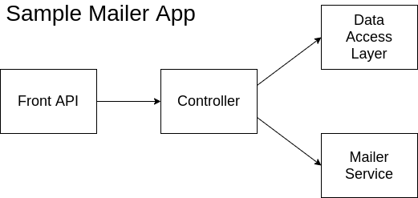

Integration Testing
===================

It is a step in the testing process that lies among unit tests and system tests. All the modules of the system, that ideally were tested in unit tests, are combined  to guarantee that they work together properly. We can consider that it works as a preparation for System tests. Data is transferred between the modules and is tested thoroughly.

Let's consider a scenario where a mailing system that records all emails sent is developed, and its modules are assigned to different developers. Using the image below as an example, each module could be due to a different programer to develop in order to increase velocity. The front API can be any kind of interface for the client to invoke like a website or a rest API, the controller is responsible for invoking the mailer service and recording the history using the Data Access Layer which is a layer for accessing some kind of storage which will be able to save the emails history in a structure somehow.

## Approaches

There are two common methods to tackle the issue of testing this whole flow, the *Big Bang* method which we code everything and then code the tests but this is usually a bad idea since it would cost more in time and it would be harder to trace errors since it is hard to isolate bugs, but it is also possible to test using an *Incremental Approach* by developing the integration tests while working on the module, but to do so it is needed to input something similar to the output of the original module and the modules must agree beforehand their expected outputs and inputs, eg.: It is possible to test the Front API by faking the controller response and passing it as an input for the Front API.

## Concepts

In order to test the modules without requiring to run the whole system everytime it is needed to know some concepts that are handy in order to structure the testing and to search for tools that helps this process.

- Stubs: A simple object with pre-determined answers for certain executions durint the tests and this is a Top Down approach. Eg.: This can be used to test the controller before having the mailer service.
- Driver: A provisional module that simulates the behavier of a module placed in a upper level and this is a Bottom Up approach. Eg.: Testing the controller behavior by calling the front API.
- Dummy: Objects with no funcionality that just needs to fill some space like filling parameters, for example.
- Mocking: It is a technique that aims to create simulated version of services or objects related to your program, not mattering wether internal or external. Eg.: When the code interacts with an object, with its functions or attributes, a mock can be used instead.

## Hands On

- Mocking with Python

- A Driver example with Python

## Special cases

Depending on the language used on the project it is possible to have more or less flexibility on testing, for example, in Python there isn't a hard limitation for accessing private fields, so it is easy to access such fields and the language provides native support to do so, but on the other hand, JVM based languages such as Java, locks any kind of access to private fields during tests, but there are some frameworks that are able to tweak the generated bytecode during the compile in order to expose those fields only for testing. This session uses python only for showing its examples but it is highly recommended to search for these concepts in others languages to seek more understanding regarding this topic.
